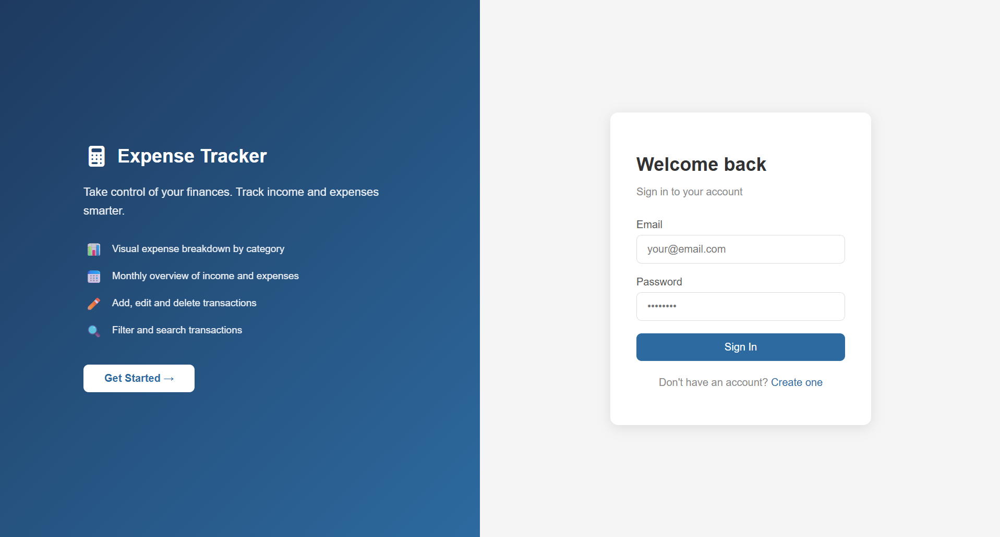
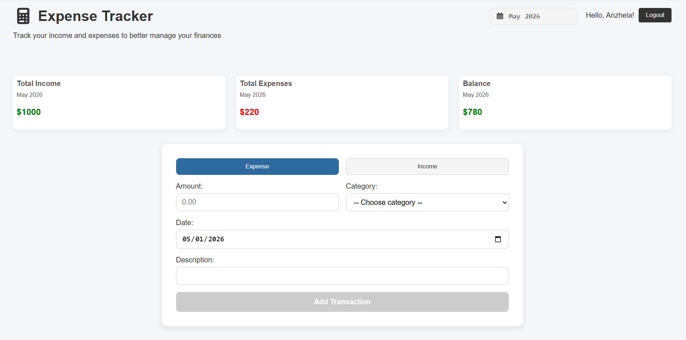
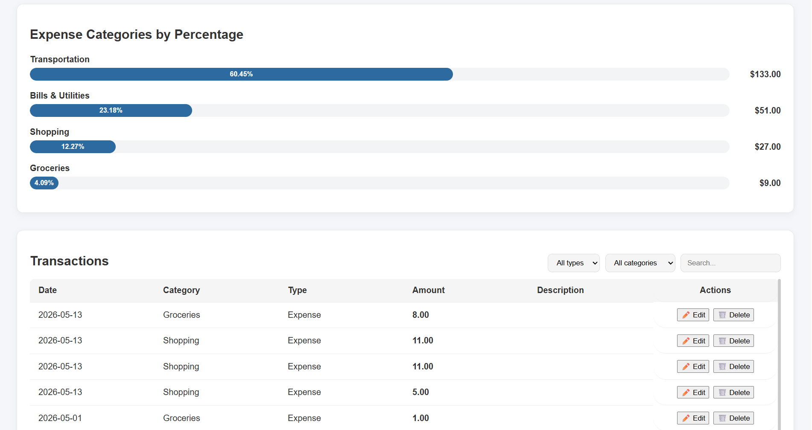

# 💰 Expense Tracker

A full-stack personal finance application for tracking income and expenses, built with Angular, Node.js, and PostgreSQL.

---

## Screenshots

### Login


### Dashboard


### Transactions & Analytics


---

## Tech Stack

**Frontend:**
- Angular 20
- TypeScript 5.8
- SCSS
- Reactive Forms

**Backend:**
- Node.js
- Express.js
- Sequelize ORM
- JWT Authentication
- bcryptjs

**Database:**
- PostgreSQL (Docker)

---

## Features

- ✅ User registration and login with JWT authentication
- ✅ Passwords hashed with bcrypt
- ✅ Protected routes with Auth Guard
- ✅ Add, edit and delete transactions
- ✅ Filter transactions by type and category
- ✅ Search transactions by description
- ✅ Monthly overview — income, expenses and balance
- ✅ Expense breakdown by category with progress bars
- ✅ Month selector synced across navbar and transaction form
- ✅ Toast notifications for all user actions
- ✅ Loading spinner while fetching data
- ✅ Form validation with error messages
- ✅ Reusable Hero component on auth pages
- ✅ Navbar hides on login/register pages

---

## Getting Started

### Prerequisites

- Node.js v18+
- Docker Desktop
- Angular CLI (`npm install -g @angular/cli`)

### 1. Clone the repository

```bash
git clone https://github.com/Anzhela-Ostrovska1/expense-tracker.git
cd expense-tracker
```

### 2. Start the database

```bash
docker run --name expense-tracker-db \
  -e POSTGRES_USER=postgres \
  -e POSTGRES_PASSWORD=postgres \
  -e POSTGRES_DB=postgres \
  -p 5432:5432 \
  -d postgres
```

### 3. Create the database tables

Connect to your database (e.g. via DBeaver) and run:

```sql
CREATE TABLE users (
  id SERIAL PRIMARY KEY,
  email VARCHAR(255) UNIQUE NOT NULL,
  password VARCHAR(255) NOT NULL,
  username VARCHAR(255),
  created_at TIMESTAMP DEFAULT NOW()
);

CREATE TABLE transactions (
  id SERIAL PRIMARY KEY,
  user_id INTEGER NOT NULL REFERENCES users(id) ON DELETE CASCADE,
  amount DECIMAL(10,2) NOT NULL,
  type VARCHAR(10) NOT NULL,
  category VARCHAR(50),
  date DATE NOT NULL,
  description TEXT,
  created_at TIMESTAMP DEFAULT NOW()
);
```

### 4. Set up the backend

```bash
cd backend
npm install
```

Create a `.env` file in `backend/src/`:

```env
PORT=5000
DB_HOST=127.0.0.1
DB_PORT=5432
DB_NAME=postgres
DB_USER=postgres
DB_PASSWORD=postgres
JWT_SECRET=your_secret_key_here
```

Start the backend:

```bash
npm run dev
```

You should see:
```
Server running on http://localhost:5000
✅ Connected to PostgreSQL via Sequelize
```

### 5. Start the frontend

```bash
cd frontend
npm install
ng serve
```

Open [http://localhost:4200](http://localhost:4200) in your browser.

---

## Project Structure

```
expense-tracker/
├── backend/
│   └── src/
│       ├── models/
│       │   ├── user.model.js
│       │   └── transaction.model.js
│       ├── routes/
│       │   ├── auth.routes.js
│       │   └── transactions.routes.js
│       ├── db.js
│       └── server.js
└── frontend/
    └── src/
        └── app/
            ├── components/
            │   ├── auth/
            │   │   ├── hero/
            │   │   ├── login/
            │   │   └── register/
            │   ├── dashboard/
            │   ├── navbar/
            │   ├── toast/
            │   ├── transaction-form/
            │   ├── transaction-list/
            │   └── category-progress/
            ├── services/
            │   ├── auth.ts
            │   ├── transaction.ts
            │   ├── month.ts
            │   └── toast.ts
            └── guards/
                └── auth-guard.ts
```

---

## Author

**Anzhela Ostrovska**
- GitHub: [@Anzhela-Ostrovska1](https://github.com/Anzhela-Ostrovska1)